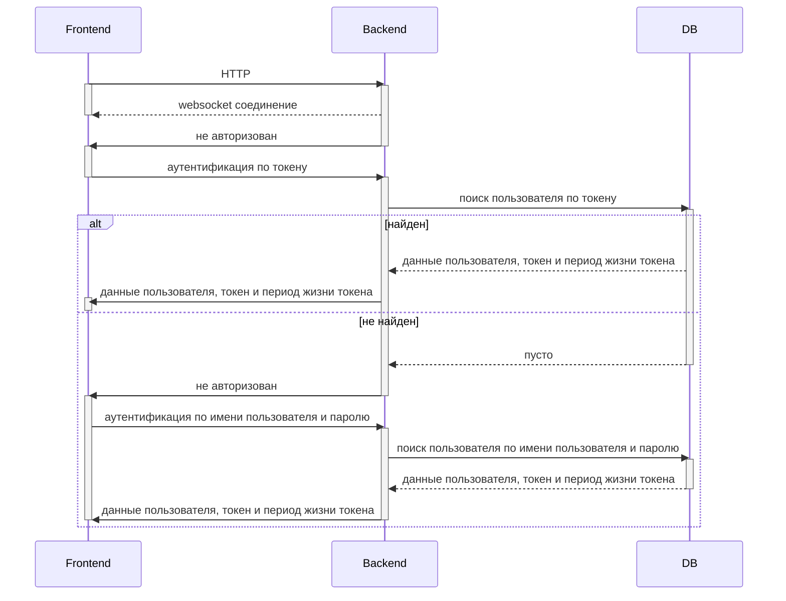

# Tasks tracker backend for production, sale and support

API системы управления производством, продажей и сопровождением на языке Go с использованием JSONRPC v2 и websocket.

## Авторизация

```mermaid
sequenceDiagram
    Frontend ->> Backend: HTTP
    activate Frontend
    activate Backend
    Backend -->> Frontend: websocket соединение
    deactivate Frontend
    Backend ->> Frontend: не авторизован
    deactivate Backend
    activate Frontend
    Frontend ->> Backend: аутентификация по токену
    deactivate Frontend
    activate Backend
    Backend ->> DB: поиск пользователя по токену
    activate DB
    alt найден
        DB -->> Backend: данные пользователя, токен и период жизни токена
        Backend ->> Frontend: данные пользователя, токен и период жизни токена
        activate Frontend
        deactivate Frontend
    else не найден
        DB -->> Backend: пусто
        deactivate DB
        Backend ->> Frontend: не авторизован
        deactivate Backend
        activate Frontend
        Frontend ->> Backend: аутентификация по имени пользователя и паролю
        activate Backend
        Backend ->> DB: поиск пользователя по имени пользователя и паролю
        activate DB
        DB -->> Backend: данные пользователя, токен и период жизни токена
        deactivate DB
        Backend ->> Frontend: данные пользователя, токен и период жизни токена
        deactivate Backend
        deactivate Frontend
    end 
```